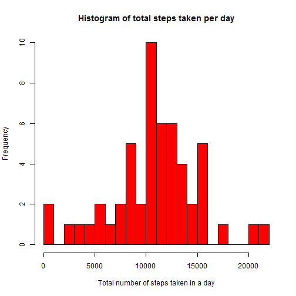
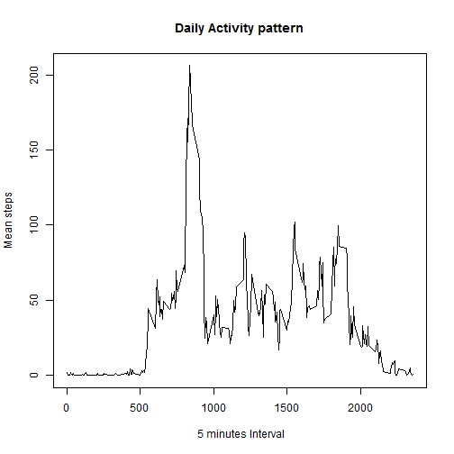
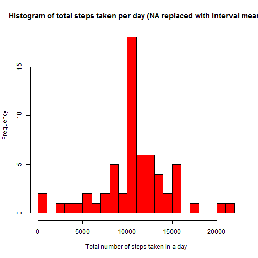
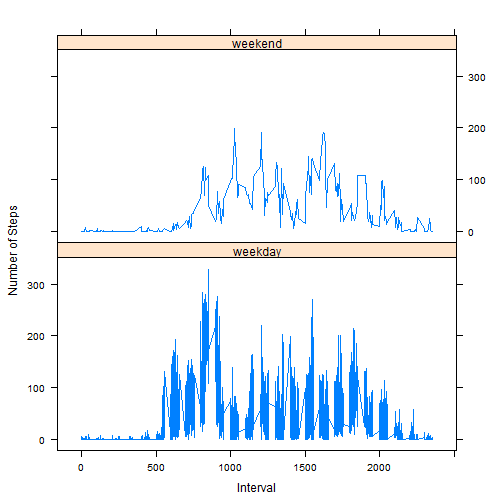

## Introduction
This assignment makes use of data from a personal monitoring device available from the course website <https://d396qusza40orc.cloudfront.net/repdata%2Fdata%2Factivity.zip>. Details can be found in README regarding the dataset. The data is loaded, processed and analyzed according to the outline provided.   

## Loading and preprocessing the data

Following steps are taken in this section: 

**Load the data** 


```r
# clear workspace
rm(list=ls())
options(scipen = 1)  # Turn off scientific notations for numbers

if(file.exists("activity.csv")){ #processed file exists
        print("file already downloaded and processed...")
        
} else # download the file and process it 
{
        fileUrl <- "https://d396qusza40orc.cloudfront.net/repdata%2Fdata%2Factivity.zip"
        tempFile <- tempfile() # download as a temporary file
        download.file(fileUrl, tempFile)
        # unzip the file 
        unzip(tempFile) #, "activity.csv"), colClasses = c("integer", "Date", "factor")) 
        unlink(tempFile) # unlink the temp file
        
        # clean up  temp vars used by this script
        rm("fileUrl", "tempFile")  
        
}

# load the raw data
activity <- read.csv("activity.csv")
```

**Process/transform the data (if necessary) into a  suitable format for required analysis**


```r
# Transform date in POSIX format
activity$date <- as.POSIXct(activity$date, format="%Y-%m-%d")
```

## What is mean total number of steps taken per day?

For this part of the assignment, the missing values in the dataset can be ignored and the following tasks are to be carried on.

**Make a histogram of the total number of steps taken each day**


```r
# Compute the total number of steps each day ignoring NA values 
  dailyActivity <- aggregate(activity$steps, by=list(activity$date), FUN=sum) # default action is to ignore NA values

# assign col name
  names(dailyActivity) <- c("date", "totalSteps")
  #alternative way
  #require("dplyr") 
  #dailyActivity2 <- activity %>% group_by(date) %>% summarise(sumSteps = sum(steps))
  
# plot histogram
  
  hist(dailyActivity$totalSteps, 
       breaks = 25, 
       col = "red",
       xlab = "Total number of steps taken in a day",
       main = "Histogram of total steps taken per day")
```

 
  

**Calculate and report the mean and median total number of steps taken per day**


```r
  # mean value - remove NA data
  mean(dailyActivity$totalSteps, na.rm = TRUE)
```

```
## [1] 10766.19
```

```r
  # median value - remove NA data
  
  median(dailyActivity$totalSteps, na.rm = TRUE)
```

```
## [1] 10765
```

The calculated mean and median values are _10766_ and _10765_, respectively.

## What is the average daily activity pattern?


** Make a time series plot of the 5-minute interval (x-axis) and the average number of steps taken, averaged across all days **


```r
# Compute the means of steps accross all days for each interval
intervalMean <- aggregate(activity$steps, 
                       by=list(activity$interval), 
                       FUN=mean, 
                       na.rm=TRUE)

# Rename the attributes
names(intervalMean) <- c("interval", "mean")

# Compute the time series plot
plot(intervalMean$interval, 
     intervalMean$mean, 
     type="l", 
     xlab=" 5 minutes Interval", 
     ylab="Mean steps", 
     main="Daily Activity pattern")
```

 

** Which 5-minute interval, on average across all the days in the dataset, contains the maximum number of steps? **


```r
 max_steps <- which.max(intervalMean$mean)
 print(intervalMean[max_steps,])
```

```
##     interval     mean
## 104      835 206.1698
```

So, the 5-minute interval # _835_ contains the maximum number of steps.

## Imputing missing values

Note that there are a number of days/intervals where there are missing values (coded as NA). The presence of missing days may introduce bias into some calculations or summaries of the data.

**Calculate and report the total number of missing values in the dataset (i.e. _the total number of rows with NAâ<U+0080><U+0099>s_)**


```r
 na.count <- sum(is.na(activity$steps)) # boolean true and false values are 1 and 0, respectively 
```

The total number of missing values in the dataset is _2304_.

**Devise a strategy for filling in all of the missing values in the dataset.** _The strategy does not need to be sophisticated. For example, you could use the mean/median for that day, or the mean for that 5-minute interval, etc._

Let us use the mean for that 5-minute interval to fill each NA value in the steps column.


```r
 # create new data that should not contain any NA field from activity
 
 activityNoNA <- activity  # just copy activity
 
 # find the pos of NA
 
 na.pos <- which(is.na(activityNoNA$steps))
 
 # replace the NA with the corresponding interval's mean value
 
 for (i in na.pos) {     
         activityNoNA$steps[i] <- intervalMean[which(activityNoNA$interval[i] == intervalMean$interval), ]$mean
 }
 
 # check the updated data
 head(activityNoNA)
```

```
##       steps       date interval
## 1 1.7169811 2012-10-01        0
## 2 0.3396226 2012-10-01        5
## 3 0.1320755 2012-10-01       10
## 4 0.1509434 2012-10-01       15
## 5 0.0754717 2012-10-01       20
## 6 2.0943396 2012-10-01       25
```

```r
 # double check if any NA field exists
 
 sum(is.na(activityNoNA))
```

```
## [1] 0
```

**Make a histogram of the total number of steps taken each day.**


```r
 # repeat the previous process but use new data
# Compute the total number of steps each day (NA values replaced)
  dailyActivityNoNA <- aggregate(activityNoNA$steps, by=list(activityNoNA$date), FUN=sum) 

# assign col name
  names(dailyActivityNoNA) <- c("date", "totalSteps")
  
# plot histogram
  
  hist(dailyActivityNoNA$totalSteps, 
       breaks = 25, 
       col = "red",
       xlab = "Total number of steps taken in a day",
       main = "Histogram of total steps taken per day (NA replaced with interval mean)")
```

 

**Calculate and report the mean and median total number of steps taken per day. Do these values differ from the estimates from the first part of the assignment? What is the impact of imputing missing data on the estimates of the total daily number of steps? **


```r
  newMean <- mean(dailyActivityNoNA$totalSteps)
  newMean
```

```
## [1] 10766.19
```

```r
  newMedian <- median(dailyActivityNoNA$totalSteps)
  newMedian
```

```
## [1] 10766.19
```

The new mean and median of total number of steps per day is 10766 and 10766, respectively.

Compare them with the two before imputing missing data:


```r
   oldMean <- mean(dailyActivity$totalSteps, na.rm = TRUE)
  # median value - remove NA data
  
   oldMedian <-  median(dailyActivity$totalSteps, na.rm = TRUE)
  #difference
  newMean - oldMean
```

```
## [1] 0
```

```r
  newMedian - oldMedian
```

```
## [1] 1.188679
```

So, after imputing the missing data, the new mean of total steps taken per day is the same as that of the old mean, which is expected as we replaced the NA values with the mean of that particular interval, so, the new mean is not changed. However, the new median of total steps taken per day is changed that of the old one, which is expected because of the same reason stated above.

## Are there differences in activity patterns between weekdays and weekends?

** Create a new factor variable in the dataset with two levels -- "weekday" and "weekend" indicating whether a given date is a weekday or weekend day.**


```r
  # create data frame with original struc, days and whether weekday/weekend 
activity <- data.frame(date=activity$date, 
                       day = tolower(weekdays(activity$date)),
                       steps = activity$steps,
                       interval = activity$interval,
                       daytype = ifelse(tolower(weekdays(activity$date)) == "satuday" | 
                                                tolower(weekdays(activity$date)) == "sunday", "weekend","weekday")
                       )
```

**Make a panel plot containing a time series plot (i.e. type = "l") of the 5-minute interval (x-axis) and the average number of steps taken, averaged across all weekday days or weekend days (y-axis).**


```r
  # Compute the average number of steps taken, averaged across all daytype variable
meanData <- aggregate(activity$steps, 
                       by=list(activity$daytype, 
                               activity$day, activity$interval), FUN ="mean", na.rm = TRUE)

# Rename the attributes
names(meanData) <- c("daytype", "weekday", "interval", "mean")

# and display

head(meanData)
```

```
##   daytype  weekday interval     mean
## 1 weekday   friday        0 0.000000
## 2 weekday   monday        0 1.428571
## 3 weekday saturday        0 0.000000
## 4 weekend   sunday        0 0.000000
## 5 weekday thursday        0 5.875000
## 6 weekday  tuesday        0 0.000000
```

```r
#plot the time series

require(lattice)
```

```
## Loading required package: lattice
```

```r
xyplot(mean ~ interval | daytype, meanData,
       type="l",
       layout = c(1,2),
       xlab="Interval",
       ylab = "Number of Steps"
)
```

 


